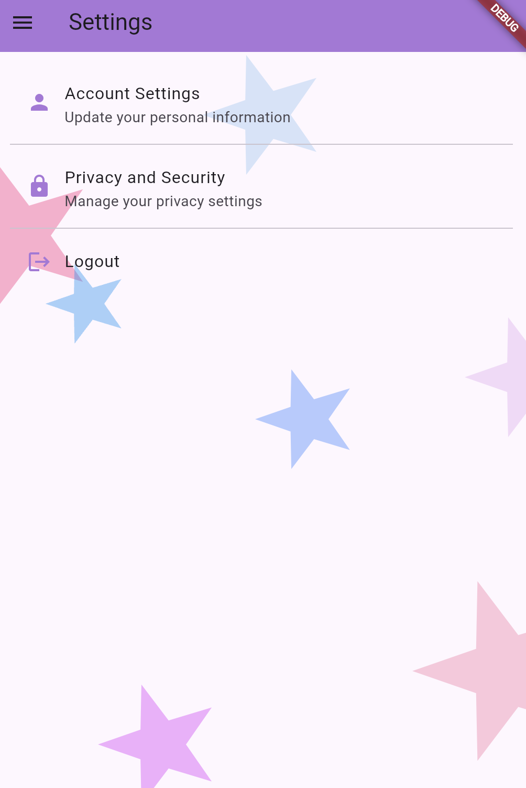

Nama : Amarramitha Poodja Thantawi
NIM : H1D022064
Shift : C

1. Proses Login
- Pengguna memasukkan username dan password di halaman login.
- Setelah menekan tombol Login, username disimpan menggunakan SharedPreferences.
- Navigasi ke HomePage dilakukan menggunakan Navigator.pushReplacement() setelah login berhasil.

2. Proses Perpindahan Halaman dengan Sidebar
- SideMenu berfungsi sebagai navigasi. Setiap menu seperti Dashboard, Settings, atau About menggunakan ListTile dengan aksi onTap.
- Ketika salah satu item diklik, halaman baru dibuka menggunakan Navigator.pushReplacement().

3. Penggunaan Router (Navigasi)
- Menggunakan Navigator.pushReplacement() untuk berpindah halaman dan mengganti halaman saat ini dengan halaman baru.
- pushReplacement digunakan untuk memastikan pengguna tidak bisa kembali ke halaman sebelumnya (misalnya setelah login). 
Jadi, setelah pengguna berhasil login, aplikasi menggunakan Navigator.pushReplacement() untuk menavigasi dari halaman login ke halaman utama (HomePage). Dengan pushReplacement(), halaman login akan dikeluarkan dari stack navigasi. Ini berarti pengguna tidak bisa kembali ke halaman login menggunakan tombol back, karena halaman tersebut sudah digantikan oleh halaman HomePage.

Lampiran:

